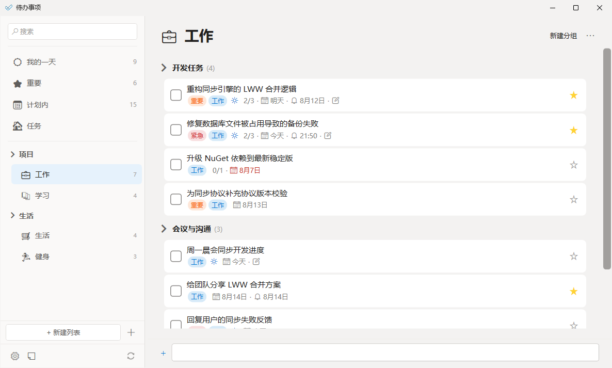
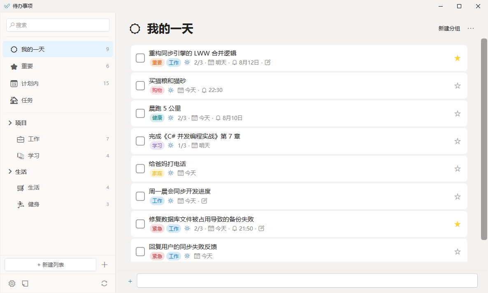
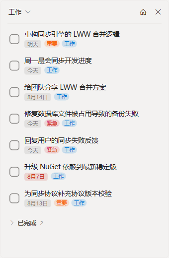
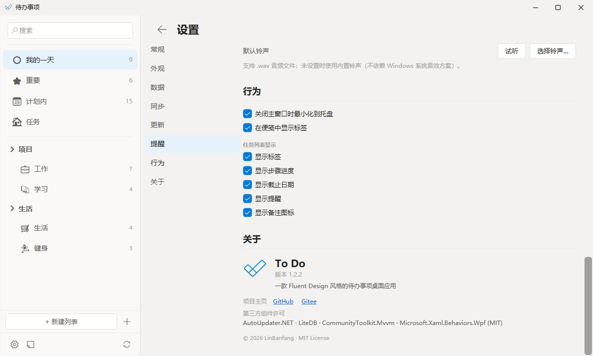

# To Do

Fluent Design 风格的待办事项桌面应用，基于 WPF (.NET 9) 开发，本地 LiteDB 存储，中英双语。

## 截图

自定义列表：任务分组、子步骤进度、彩色标签、截止日期、提醒、备注、重要标记



「我的一天」：今日待办 + 今天到期的任务汇总



迷你便笺：始终置顶的速览便笺，可完成任务 / 切换列表 / 恢复已完成，任务行显示彩色标签



内嵌设置页：主题、语言、行为（任务行显示开关）、数据库路径、数据备份 / 恢复、多端同步



> 截图由演示数据生成，可用脚本一键复现：`powershell -ExecutionPolicy Bypass -File tools/screenshots/capture-screenshots.ps1`，详见 [docs/screenshots.md](docs/screenshots.md)。

## 功能

- **列表管理** — 系统列表（我的一天 / 重要 / 计划内 / 任务）+ 自定义列表，支持列表分组、分组折叠
- **子步骤** — 每个待办项可添加步骤，支持行内编辑、拖拽排序、完成状态、一键升级为任务
- **自定义标签** — 可创建带颜色的标签（色板 + HEX 输入 + 原生取色器自定义颜色），右键菜单或详情面板分配
- **双重关闭** — 勾选 = 完成（绿色），右键 = 取消（灰色斜线），均记录关闭时间且可编辑
- **截止日期 / 提醒** — 快捷菜单选日期（今天/明天/下周/自定义）和提醒时间；提醒到点弹系统通知并响铃
- **搜索** — 跨所有列表按标题 / 备注实时过滤
- **拖放操作** — 待办项拖动排序（上半/下半半区插入）、移入 / 移出分组、移到其他列表；侧边栏列表拖动排序 / 归类
- **迷你便笺 + 系统托盘** — 主界面 footer 图标或托盘右键呼出始终置顶的无边框速览便笺（可完成任务 / 切换列表 / 恢复已完成任务），「返回主界面」恢复主窗、「关闭」回到托盘；关闭主窗口默认最小化到托盘，托盘菜单可打开主界面 / 便笺 / 退出（可配置）
- **设置页** — 内嵌设置页（侧边栏底部齿轮进入）：主题、语言、数据库路径、更新源、启动检查更新、提醒通知/提示音、行为（关闭最小化到托盘 / 便笺显示标签 / 任务行显示标签、步骤、截止日期、提醒、备注开关）、数据备份/恢复
- **中英文切换** — 设置页切换语言，全界面（含弹窗、转换器）本地化，重启生效并自动记忆
- **Fluent 风格对话框** — 删除确认、日期时间、数据库路径、标签管理等对话框统一使用 Fluent 模板，颜色跟随浅色 / 深色主题
- **浅色 / 深色主题** — 设置页切换主题，即时生效并自动记忆；窗口标题栏 / 边框颜色同步跟随主题（DWM 着色，Windows 10/11）
- **本地存储** — LiteDB 嵌入式数据库，数据文件默认在 `%LOCALAPPDATA%\ToDo\todo.db`，路径可在设置页变更并自动迁移，支持导出备份 / 恢复
- **多端同步（可选）** — 自建轻量同步服务器（ToDo.Server），多设备间同步任务 / 列表 / 分组 / 标签 / 步骤 / 重要标记；「我的一天」保留在本设备、不同步。设置页填服务器地址 + 同步密钥即可开启，部署见 [ToDo.Server/deploy/DEPLOY.md](ToDo.Server/deploy/DEPLOY.md)
- **自动更新** — 启动时按序检查多个更新源（GitHub / Gitee / 私有 appcast），发现新版本一键自动下载、替换并重启（基于 vendored AutoUpdater.NET，MIT）；更新源可在设置页编辑，启动检查可关闭；手动检查失败会显示真实原因，诊断日志写入 exe 同路径 `logs` 文件夹

## 运行

```bash
cd ToDo
dotnet run
```

## 技术栈

| 层面 | 选型 |
|---|---|
| 框架 | WPF (.NET 9) |
| MVVM | CommunityToolkit.Mvvm |
| 数据库 | LiteDB（客户端） / SQLite（同步服务器） |
| 共享库 | ToDo.Core（net9.0，WPF 与未来 MAUI 复用） |
| 同步服务器 | ToDo.Server（.NET 9 Minimal API + EF Core，自建部署） |
| 样式 | 原生 WPF Fluent Design 自定义模板 |
| 本地化 | 静态字符串 + 窗口重建 |

## 项目结构

```
ToDo.Core/           共享库（模型 / DatabaseService / 本地化 / 同步引擎，net9.0）
ToDo/                WPF 客户端（Views / ViewModels / Services / Styles / Converters）
ToDo.Server/         同步服务器（Minimal API + SQLite，含 deploy/ 部署脚本与指南）
ToDo.Tests/          WPF 客户端与 Core 测试
ToDo.Server.Tests/   同步服务器测试
ToDo.Demo/           演示数据生成工具（灌入展示各功能示例的数据库，用于截图 / 试用）
```

## 设计文档

- 变更日志：[CHANGELOG.md](CHANGELOG.md)
- 路线图：[docs/ROADMAP.md](docs/ROADMAP.md)
- 详细设计方案：[docs/design.md](docs/design.md)
- 设置页设计：[docs/settings-page.md](docs/settings-page.md)
- 诊断日志设计：[docs/logging.md](docs/logging.md)
- 截图生成与验证：[docs/screenshots.md](docs/screenshots.md)
- 同步服务器部署：[ToDo.Server/deploy/DEPLOY.md](ToDo.Server/deploy/DEPLOY.md)
- 架构决策记录（ADR）：[docs/adr/](docs/adr/)

## 许可

本项目基于 MIT 许可开源，详见 [LICENSE](LICENSE)。
